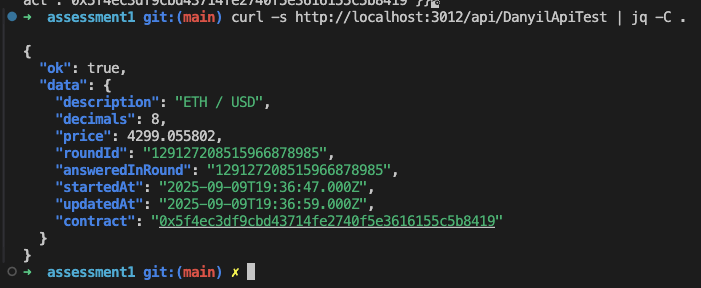

# Assessment

## Result screenshot



## Description

The endpoint `/api/DanyilApiTest` fetches the latest ETH/USD price from the Chainlink aggregator smart contract.

Example call (pretty-printed):

```bash
curl -s http://localhost:{PORT}/api/DanyilApiTest | jq -C .
```

## 📝 Objective

The goal of this assessment is to evaluate your ability to:

- Work with Node.js backend code.
- Interact with blockchain smart contracts.

---

## 📌 Task Instructions

1. **Create a New API Endpoint**

   - Add a new API endpoint in `index.js` named:

     ```
     [Name]ApiTest
     ```

2. **Smart Contract Interaction**

   - Select any **pre-deployed** or **public smart contract** (mainnet or testnet).
   
   - Fetch some data (any useful information such as balance, contract state, or public variables).
   
   - The logic should fetch data through your new API endpoint.


3. **Output**

   - The result should be printed to the console.
   - No need for complex UI or data persistence 
   - just demonstrate that the data was fetched successfully.

---

## 📤 Submission

Once completed, submit one of the following:

- **short video** recording your work.
- **screenshots** showing the API call and console result.
- **Github Link** where your assessment result were pushed.

---

## ⏰ Time Expectation

- Estimated time to complete: **30–60 minutes**.

---

## ⚙️ Notes

You may use any blockchain provider such as:

  - **ethers.js**
  - **web3.js**
  - Any public RPC provider (Infura, Alchemy, QuickNode, etc.)
  
Keep your code **clean, simple, and easy to review**.

Handle errors gracefully where possible.

---
## 🚀 Quick Start Guide

To run the project locally:

```bash
# Clone the repository (if provided)
git clone [repo-url]

# Move into the project directory
cd [project-folder]

# Install dependencies
npm install

# Start the server
npm start